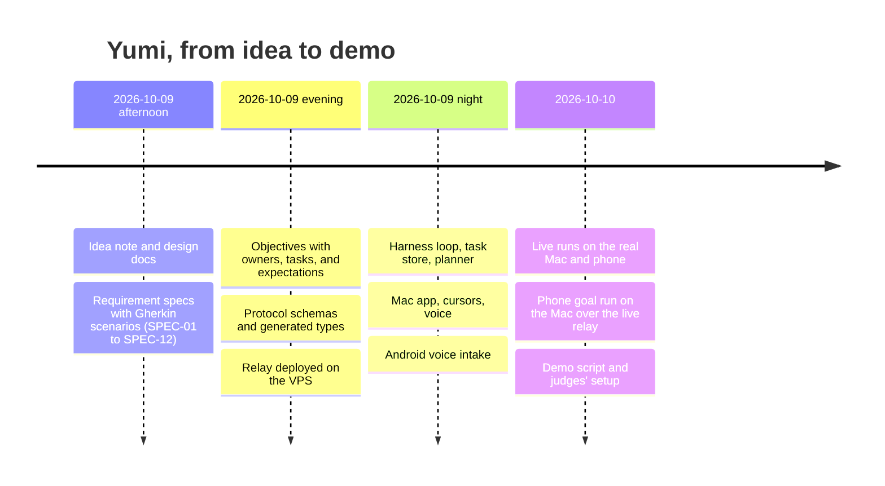
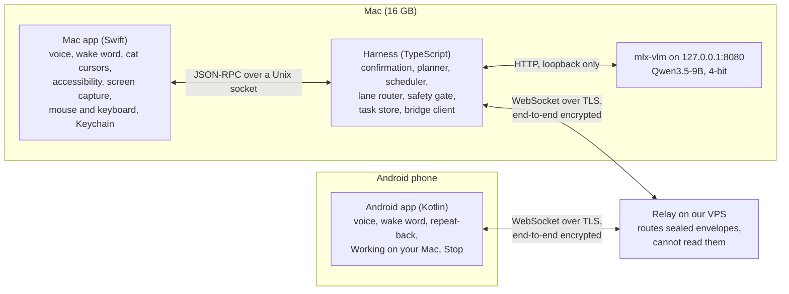
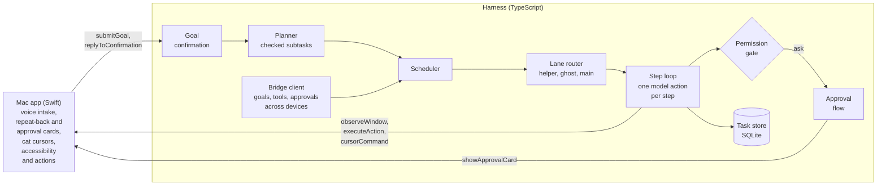
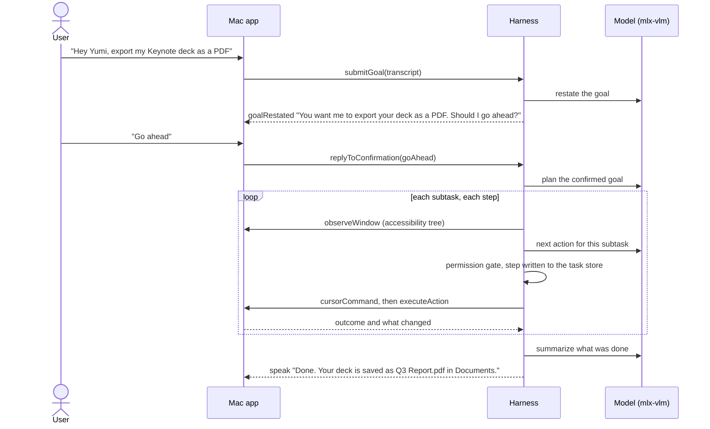
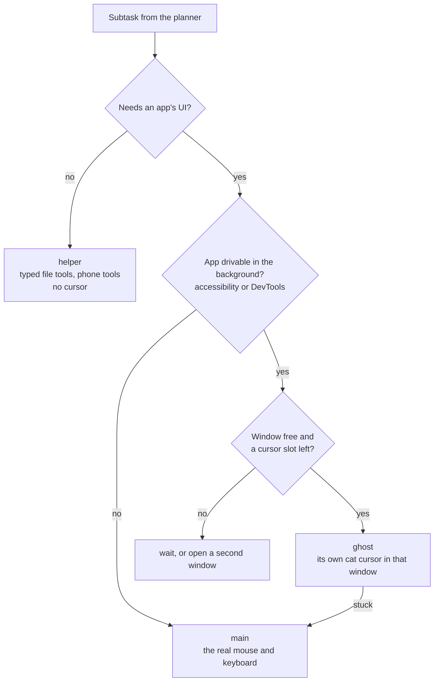
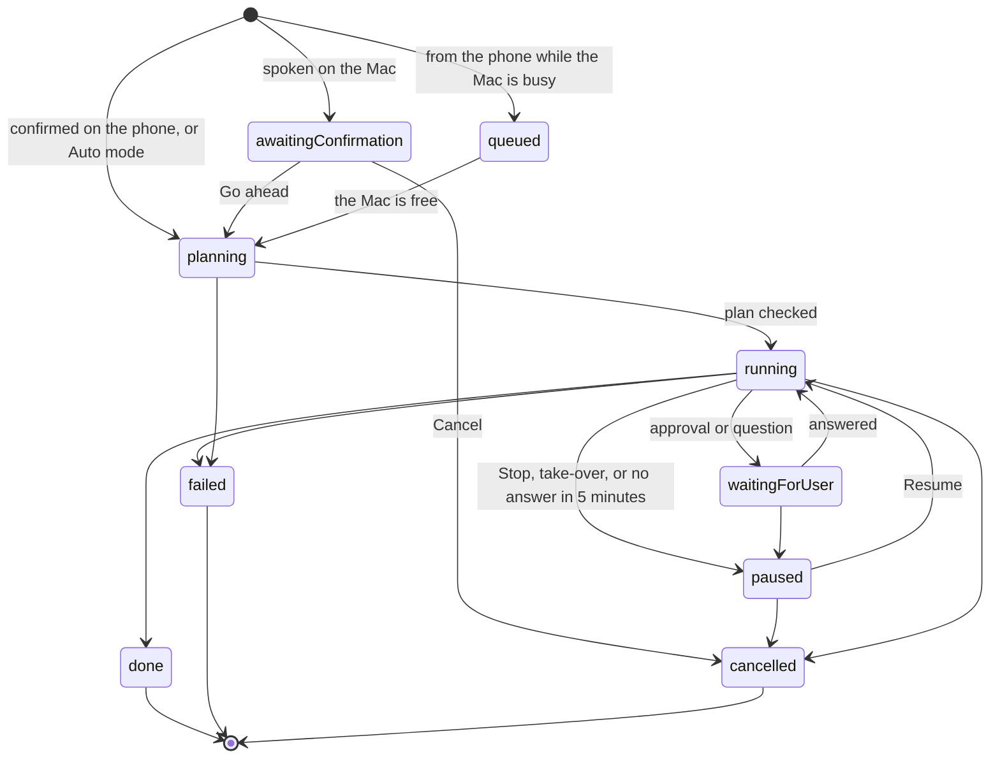
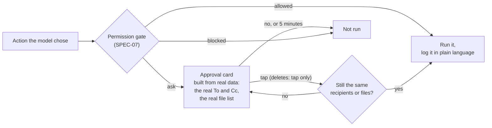
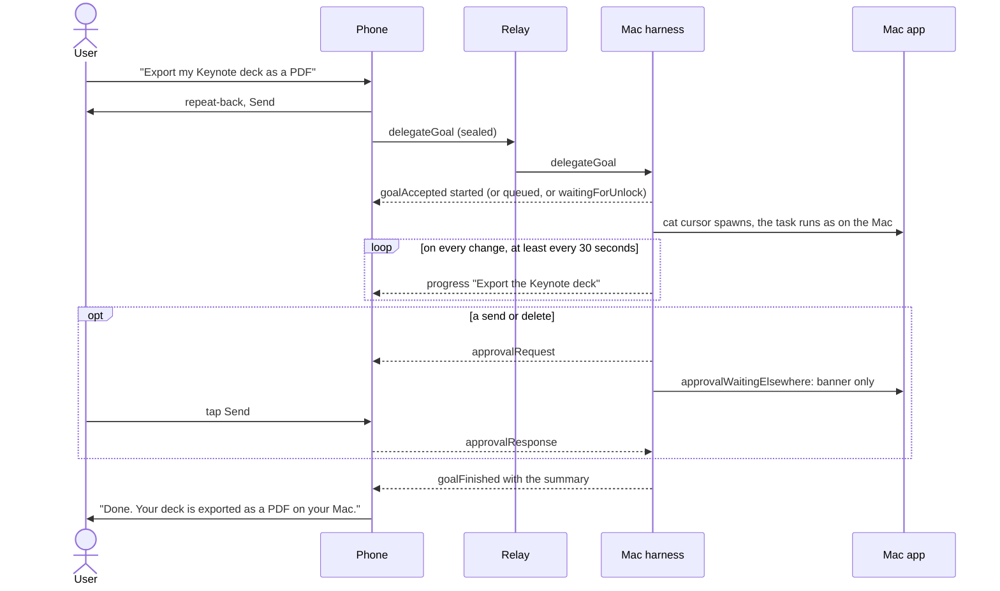
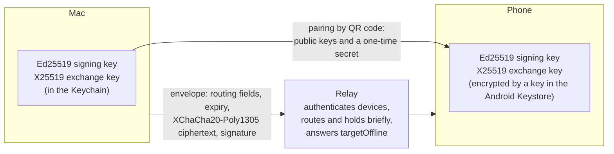
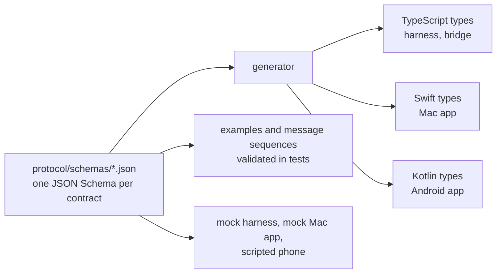

# Yumi architecture

Part of [Yumi](yumi.md).
This page explains how Yumi is put together, why it is built this way, and how the idea came about.
What works live today and what was cut is in the [README](../README.md#what-works-and-what-does-not); this page describes the design.

## How we came up with it

### The bet

Yumi started as one question for a local-AI hackathon: can a computer-use agent that runs entirely on your own devices feel trustworthy enough to hand real work to?
The idea note ([yumi.md](yumi.md), 2026-10-09) answered with four bets.

1. **Local only is the pitch.** The strongest open models (Kimi K2, GLM-4.6, DeepSeek V3) need 250 GB or more, so they are out.
   A 9-billion-parameter model at 4 bits fits on a 16 GB Mac next to the apps it works in.
2. **The leverage is the harness, not the model.** A small model is good at one small step at a time and bad at remembering a long plan.
   So the model only picks the next action, and the harness owns everything that must not go wrong: planning state, routing, locks, checkpoints, safety, and the cursor.
3. **You should see it work.** An agent that clicks around invisibly is hard to trust.
   Yumi works the way a person would, with a visible cursor shaped like a cat, and it repeats every goal back before doing anything.
4. **Your phone is part of it.** A goal spoken on the phone can run on the Mac, and the Mac can use the phone's tools, through a relay that cannot read the messages.

### Why these choices

| Question | Choice | Why |
|---|---|---|
| Which model | Qwen3.5-9B at 4 bits through mlx-vlm on the Mac | Fits the 16 GB demo Mac with about 3 parallel contexts. UI-TARS-1.5-7B was kept only as a fallback: Qwen3.5-4B already beats it on ScreenSpot-Pro and OSWorld at half the memory ([yumi.md](yumi.md)). |
| How it sees apps | The accessibility tree first, a screenshot only when an app has no tree | Reading a tree is fast and exact; reading pixels is slow and a 4-bit model clicks less precisely. |
| Where it runs | A TypeScript harness next to a native Swift app | The agent loop is a fork of Pi's minimal loop with its coding tools replaced by desktop tools; macOS work (accessibility, screen capture, mouse, keyboard, overlay cursors, Keychain) needs Swift. |
| How devices talk | Our own relay on a VPS, end-to-end encrypted | The relay only routes sealed messages. Nothing about a goal is readable outside the two devices. |
| How it listens | On-device speech everywhere, Whisper for Taglish | Never cloud speech. The team speaks Taglish, which Apple's on-device recognizer does not cover. |
| What the phone is | First a voice remote and tool host with no model, later its own brain | A phone-sized model was a risk for the demo; a fixed rule plus delegation to the Mac was not. |

### How it was built

The whole project ran spec first, in about two days, with three people and their coding agents working in parallel.

- **Specs say what to build.** Each spec in [specs/](../specs/README.md) has numbered requirements and Gherkin scenarios, and records every decision with its reason.
- **Objectives say how.** Each objective in [objectives/](../objectives/README.md) belongs to one product and one person, with tasks, verifiable expectations, and an Outcome written when it is done.
- **Contracts let people work at once.** Every message between products is a JSON Schema in [protocol/](../protocol/README.md), with types generated for TypeScript, Swift, and Kotlin.
  Until the other side existed, each product built against a stand-in that honors the same contract: a mock harness, a mock Mac app, a scripted phone on a fake relay.
- **Every change is checked.** `scripts/verify.py` runs the docs check and the build and tests of every product a change touches before each commit and push.

## The system at a glance

| Product | Owner | What it does |
|---|---|---|
| [protocol](../protocol/README.md) | Jepoy | Every contract: task records, actions, local RPC, bridge messages, crypto, generated types, mocks |
| [harness](../harness/README.md) | Brent | The brain on the Mac: plans, routes, runs, checks, and remembers every task |
| [mac](../mac/README.md) | Patrick | Everything native to macOS, and everything the user sees and hears on the Mac |
| [android](../android/README.md) | Brent | The phone: voice remote, cross-device goals, later its own tools and model |
| [bridge](../bridge/README.md) | Jepoy | The relay on the VPS |
| [models](../models/README.md) | Jepoy | Model choice, benchmarks, and the wake word |
| [character](../character/README.md) | Patrick | Yumi the cat |

## Inside the Mac

The Mac app and the harness are separate processes.
The app owns everything native and everything the user sees; the harness owns every decision.
They meet only at the local RPC contract ([protocol/schemas/rpc.json](../protocol/schemas/rpc.json)), JSON-RPC 2.0 over `harness.sock` in `~/Library/Application Support/Yumi`, which only this user can open.

### Why the harness owns the plan

The model is asked small questions with fresh context, and the harness keeps the answers.

- **The planner** turns a confirmed goal into a few subtasks, each with a title, an instruction, a proposed lane, and its dependencies.
  The harness checks the plan before anything runs: tools that exist, paths inside the home folder, no cycles, at most 8 tools offered (SPEC-05 r9).
- **The worker** sees one subtask, a trimmed view of the window, and its own last steps, and answers with exactly one action in a narrowed JSON schema.
  The model never sees the whole plan, and never decides whether an action is safe.
- **The task store** writes every step before it runs and its outcome after, so a crash or a restart resumes from the last checkpoint instead of starting over (SPEC-02).

### The life of a goal

In Auto mode the repeat-back is skipped; sends and deletes still ask (SPEC-01 r14).

### Lanes and cursors

Each subtask runs in the cheapest lane that passes every check ([lane-router.md](lane-router.md)).

- At most 3 visible cursors, the main cat included, and one cursor per window, held as a lock in the task store.
- A ghost never sends keystrokes or clicks at screen coordinates, since those move the real mouse; when it gets stuck, it hands the step to the main cat.
- An app with no accessibility content, such as Spotify, is driven from a screenshot with a vision click ([OBJ-75](../objectives/OBJ-75-vision-fallback.md)).

### A task's states

The exact table is `harness/src/store/transitions.ts`; any other change is a bug and is refused.

## Safety

Safety is code in the harness, never a prompt.

- Every action from every lane goes through one gate, which decides `allowed`, `ask`, or `blocked` from the action and the real element or path, never from model text.
- There is no shell and no AppleScript: file work goes through typed tools only, and a test proves nothing in the harness can start a process (SPEC-07 r3).
- Deletes go to the Trash, never away for good, and need a tap; saying "yes" is not enough (SPEC-07 r7, r11).
- Stop is always one key away: Control-Option-Escape, or grabbing the mouse, freezes every cat; the step in progress finishes, and nothing new starts (SPEC-06).
- Every action is written to the action log in plain language with the time in am or pm, and typed text such as a password never reaches it (SPEC-07 r18, r20).
- Users never see internal errors: failures are structured kinds, and each app shows the SPEC-11 copy for them.

## Across devices

The device the user spoke to is the brain for that goal (SPEC-09).
It runs the goal itself or hands the whole confirmed goal to the other device; single tool calls go the other way.
Results, approvals, and progress always come back to the device the user spoke to.

### A goal from the phone

- **Stop from the phone** sends `pause`; the phone shows "Paused" only after the Mac answers `pauseConfirmed`, and if the Mac cannot be reached it says so instead.
- **A busy Mac** queues the goal behind the task at work and says so; **a locked Mac** holds it until the user unlocks the Mac, and Yumi never touches the password.
- **An offline Mac**: the phone keeps the goal itself, never on the relay, and sends it when the Mac is back, asking again if it waited more than 30 minutes ([OBJ-78](../objectives/OBJ-78-android-cross-device-edge-cases.md)).
  The phone will wake a sleeping Mac with Wake-on-LAN on the same Wi-Fi, using the hardware addresses the Mac sends it (p1, [OBJ-79](../objectives/OBJ-79-android-wake-the-mac.md)).
- **Built so far:** the Mac side of every case above, and on the phone the repeat-back, sending the goal, "Working on your Mac", Stop, and the result.
  The phone's approval card, offline queue, and Wake-on-LAN are still to build ([OBJ-71](../objectives/OBJ-71-android-approvals.md), OBJ-78, OBJ-79).

### A phone tool from the Mac

The Mac sees the phone's tools as one `phone` tool, built from the tool list the phone sends on connect, so the planner stays within its 8-tool cap.
"Set an alarm on my phone for 6:30 am" becomes one `toolCall`, answered by a `toolResult`.
A call waits at most 2 minutes and is never queued: if the phone is offline, it fails at once and Yumi says so.

### The relay and its crypto

- Each device's id is a hash of its public signing key, so the relay can check who is connecting without knowing anything else ([protocol/docs/crypto.md](../protocol/docs/crypto.md)).
- Payloads are sealed with XChaCha20-Poly1305 under X25519 session keys and signed with Ed25519, using libsodium in TypeScript, Swift, and Kotlin; shared test vectors prove all three produce the same bytes.
- Commands expire after 2 minutes and approval requests after 5, so a message delayed in transit can never run late (SPEC-08).
- The relay never sees a goal, a file name, or a result, and never holds a command for an offline device.

## Contracts and stand-ins

- A product never hand-writes a type another product uses; it imports the generated one.
- Every example round-trips through the generated Swift and Kotlin types in Docker, so the three languages agree on every shape.
- Mocks answer with the same shapes and the same error kinds as the real side, so a product built against a mock works against the real thing.
- A breaking change bumps the protocol version, which every device and the relay check when they connect.

## Where to read next

- [lane-router.md](lane-router.md), [task-record-schema.md](task-record-schema.md), and [device-bridge.md](device-bridge.md) for the design background.
- [specs/](../specs/README.md) for the behavior, and [objectives/](../objectives/README.md) for what is built and by whom.
- [wiki/demo-script.md](../wiki/demo-script.md) and [wiki/judges-setup.md](../wiki/judges-setup.md) to see it run.
