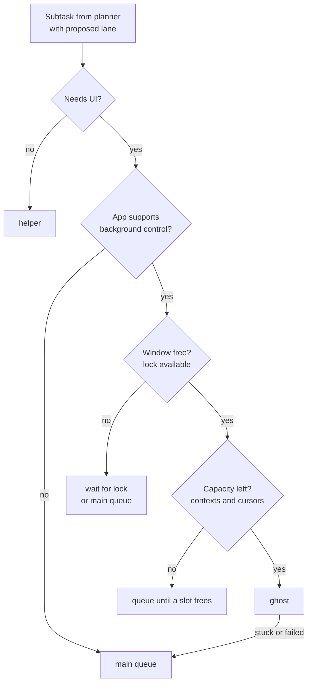

# Lane Router

Part of [Desktop Companion](desktop-companion.md).
Uses the [Task Record Schema](task-record-schema.md).

The lane router decides how each subtask runs.
The planner proposes a lane, and the harness verifies it before anything spawns.
The model is never trusted to know what an app supports.

## Lanes

| Lane | Use when | Controls | What the user sees |
|---|---|---|---|
| `helper` | No UI needed: files, search, summarize, MCP tools | MCP servers, shell, file APIs | A status chip, no cursor |
| `ghost` | App can be driven in the background | Accessibility API (`AXPress`, `AXValue`), Chrome DevTools protocol | A labeled, colored overlay cursor in that window |
| `main` | Needs the real mouse or keyboard focus | CGEvent mouse and keyboard | The primary companion cursor |

Cost order: `helper` < `ghost` < `main`.
The router always picks the cheapest lane that passes every check.
`main` is the fallback and always accepts work.

## Routing flow



## Checks

The router runs these in order.
Any failure moves the subtask to the next more expensive lane, or queues it.

1. **Needs UI.** Does the subtask have a target app or window? If not, it is a `helper`.
2. **Background capability.** Probe the target app once and cache the result per app and version.
   - Accessibility: the app exposes an `AXUIElement` tree with actionable elements (`AXPress`, settable `AXValue`).
   - Browser: Chrome or a Chromium browser with the DevTools protocol available.
   - Known bad: canvas apps, games, Electron apps with thin accessibility trees, anything needing drag and drop.
3. **Window lock.** Only one cursor per window. Locks are held in the task store, not in memory, so they survive a restart.
4. **Capacity.** Free model slots (parallel contexts) and the visible cursor cap (default 3, including `main`).
5. **Risk.** Destructive actions (send, delete, buy, submit) always require confirmation, on every lane.

## Lane-specific rules

- **Keyboard focus is single.** Only `main` may send keystrokes. `ghost` sets text through `AXValue` or the DevTools protocol.
- **Ghosts need a visible window.** Covered windows are fine (ScreenCaptureKit captures them). Minimized windows are not. The harness may unminimize or tile windows before spawning.
- **Helpers never touch the UI.** If a helper discovers it needs UI, it returns a new subtask instead of acting.

## Handoff (promotion)

A ghost that fails is promoted to `main`, not retried forever.

1. Ghost hits a failure: element not found, action had no effect, or 2 consecutive invalid model outputs.
2. Harness marks the step `failed`, the subtask `handoff`, and releases the window lock.
3. Subtask joins the `main` queue with its step log intact.
4. On screen, the ghost fades and the main cursor flies to that window.
5. Main reads the task record plus a fresh screenshot and continues from the last good step.

The same handoff works between any two workers.
No worker needs another worker's conversation, only the task record.

## Router signature

```swift
enum Lane: String, Codable { case helper, ghost, main }

struct RouteDecision: Codable {
    let lane: Lane
    let reason: RouteReason          // why this lane, for the dashboard and logs
    let lock: WindowLock?            // held if lane is ghost or main
}

enum RouteReason: String, Codable {
    case noUI
    case backgroundCapable
    case appNotBackgroundCapable
    case windowLocked
    case atCapacity
    case promotedAfterFailure
}

protocol LaneRouter {
    func route(_ subtask: Subtask, proposed: Lane) async -> RouteDecision
}
```

## User interrupts

- **Real mouse or keyboard input by the user** pauses every UI lane immediately (watched with a CGEvent tap). Helpers keep running.
- **"Stop" by voice** pauses everything and checkpoints.
- **"Continue"** resumes from the checkpoint and re-captures the screen first, since the user may have changed things.

## Open questions

- Should the planner see the capability cache when proposing lanes, to propose better first guesses?
- How long should a ghost wait for a window lock before falling back to `main`?
- Do we tile windows automatically for the demo, or ask first?
